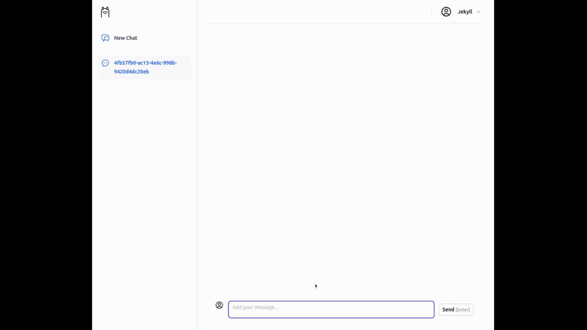

# Insight - Jacked RAG

RAG - Retrieval Augmented Generation. This is the Jacked initiative for that within the PHP ecosystem.

> This solution streams back the text chunks of the response coming from the LLM. There is a WebSocket experiment that accomplishes the same in the branch [websocket-experiment](https://github.com/Jacked-PHP/insight/tree/websocket-experiment).

## Usage

Sample credentials:

Username: `jekyll@example.com`

Password: `password`



## Installation

Before start you need to make sure you have the following dependencies:

- php8.2 or higher
- php openswoole extension
- docker (for postgres db)

### Step 1

Clone the repository:

```bash
git clone https://github.com/Jacked-PHP/insight my-project
```

Then `cd my-project` 

### Step 2

Install dependencies (php composer and npm):

```bash
composer install
```

```bash
npm install
```

### Step 3

```bash
npm run build
```
(or `npm run dev` if you are developing and want the hot reload)

### Step 4

Prepare the database:

```bash
docker-compose up -d
```

### Step 5

Make sure your `.env` is properly set:

- have db credentials
- app key (`php artisan key:generate`)
- app url (default is `http://localhost:8080`)

Then run the migrations:

```bash
php artisan migrate
```

Run the server (this is running jacked server):

```bash
php artisan jacked:serve
```

Now you can visit `http://localhost:8080` and see the application running.

## Vector DB

The free opensource solution considers the following:

- https://github.com/pgvector/pgvector

## Embedding Solution

This application uses the following embedding solution:

- ollama embedding model: [mxbai-embed-large](https://ollama.com/library/mxbai-embed-large)

## Ollama details

To run Ollama, a suggested way would be to run through docker:

```shell
docker run -d -v ollama:$HOME/.ollama -p 11434:11434 --name ollama ollama/ollama
```

> Reference: https://github.com/ollama/ollama/blob/main/docs/docker.md

